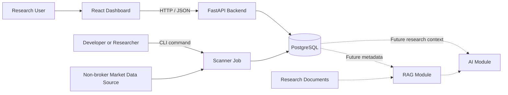
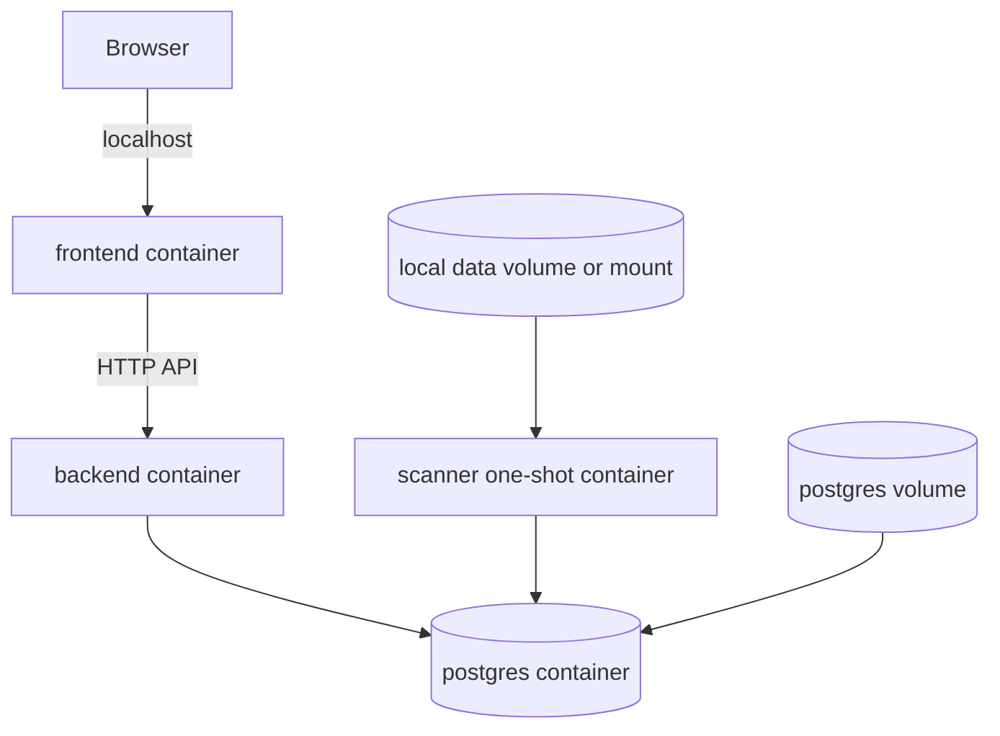

# AI Quant Research Platform

## System Design

### 1. High-Level Architecture

The MVP uses a small service-oriented architecture that runs locally with Docker
Compose:

- A React and TypeScript frontend provides the research dashboard.
- A FastAPI backend exposes versioned APIs for dashboard data.
- A Python scanner runs as a command-line job and persists scan results.
- PostgreSQL stores market data references, scan runs, and signal results.

The backend and scanner are separate runtime processes but share stable database
contracts and domain definitions. The MVP does not require a message broker,
workflow engine, vector database, or LLM service.

### 2. Main Modules

#### MVP Modules

- `backend/`: FastAPI application, API schemas, database access, and migrations.
- `frontend/`: React dashboard for scan history, results, filters, and charts.
- `scanner/`: CLI entry point, market-data ingestion and validation, indicators,
  signal rules, and scan persistence.
- `data/`: Local development fixtures, documented imports, and non-sensitive
  sample data.
- `deployment/`: Docker Compose and environment configuration.
- `tests/`: Cross-module, integration, and end-to-end tests.

#### Future Modules

- `ai/`: LLM provider abstraction and generated research summaries.
- `rag/`: Document ingestion, embeddings, indexing, and retrieval.

Each module owns a clear responsibility. Cross-module contracts should remain
small and explicit, especially database entities, API schemas, and signal
definitions.

### 3. Data Flow

#### Market Data Ingestion Flow

1. A researcher runs `ingest-asharehub` or `ingest-csv` locally or through the
   one-shot scanner container.
2. The selected provider reads stock metadata and daily OHLCV records.
3. The importer validates symbols, exchanges, dates, values, duplicate keys,
   OHLC relationships, and optional freshness expectations.
4. A single database transaction upserts stocks and daily prices.
5. The CLI returns inserted and updated counts plus structured warnings.

AShareHub is the primary Phase 3 provider. It supplies unadjusted daily data for
Shanghai, Shenzhen, and Beijing securities. The adapter normalizes volume from
lots to shares and amount from CNY thousands to CNY before persistence. It uses
explicit pagination and a per-run request budget to protect limited API quotas.

The initial `synthetic_csv_v1` fixture uses unadjusted synthetic prices,
synthetic CNY-denominated price and amount values, and volume measured in
shares. It remains the deterministic offline and automated-test provider.

#### Scan Flow

1. A researcher starts the scanner through a local command or one-shot Docker
   Compose command.
2. The scanner loads persisted historical A-share data.
3. The scanner validates data availability and freshness.
4. The scanner creates a scan-run record with its configuration and data date.
5. Technical indicators and signal rules are evaluated deterministically.
6. Results, matched values, warnings, and errors are stored in PostgreSQL.
7. The scan run is marked completed, completed with warnings, or failed.

#### Dashboard Read Flow

1. The browser requests scan runs, results, stock details, or chart data from the
   FastAPI backend.
2. The backend validates query parameters and reads the required records from
   PostgreSQL.
3. The backend returns stable JSON response models.
4. The frontend renders scan status, filters, signal details, and historical
   stock charts.

The database is the integration point between the scanner and backend in the
MVP. They do not call each other directly.

### 4. Backend Responsibilities

The backend should:

- Expose versioned HTTP APIs for the frontend.
- Provide health and readiness endpoints.
- Return scan history, scan status, summary counts, and warnings.
- Return signal results with filtering and pagination.
- Return stock metadata and historical price data required for charts.
- Validate request parameters and return consistent error responses.
- Use SQLAlchemy for database access and migrations for schema evolution.
- Keep response contracts independent from internal ORM models.
- Enforce neutral research wording and expose no trading actions.

For the initial MVP, scanner execution remains a CLI operation. An API-triggered
job system can be added later if scheduling and background execution become a
validated requirement.

### 5. Scanner Responsibilities

The scanner should:

- Run independently as a Python command-line job.
- Import approved remote or documented local market data through a small
  provider-neutral interface.
- Validate a complete import batch before starting database writes.
- Upsert stock and daily-price records atomically and idempotently.
- Accept explicit scan configuration, such as data date, stock universe, and
  enabled signal definitions.
- Load data only from approved non-broker sources or local files.
- Validate data before calculating indicators.
- Apply deterministic, versioned, and testable technical signal rules.
- Distinguish a valid non-match from insufficient or invalid data.
- Create and update scan lifecycle records.
- Persist matched signals, relevant calculation values, summaries, and errors.
- Be idempotent where practical and rely on database constraints to prevent
  duplicate results.
- Exit with meaningful status codes and produce structured logs.

The scanner must not place orders, access brokerage accounts, or depend on the
frontend or backend being available.

### 6. Frontend Responsibilities

The frontend should:

- Display recent and historical scan runs with clear statuses.
- Show matched stocks, signal types, calculation dates, and rule explanations.
- Filter and paginate results by date, stock, and signal.
- Display stock detail views with historical price and volume charts.
- Show which values caused a signal match.
- Surface missing-data warnings and scan failures without hiding uncertainty.
- Clearly show the effective market-data date and scan execution time.
- Use only backend APIs and never connect directly to PostgreSQL.
- Avoid directive, promotional, or personalized investment language.

The MVP frontend is a research viewer. It does not need AI chat, document search,
portfolio execution, or real-time streaming updates.

### 7. Database Responsibilities

PostgreSQL is the system of record for the MVP. It should store:

- Stock and exchange metadata.
- Historical price and volume data, or references to managed market data.
- Signal definitions and their versions.
- Scan runs, configuration snapshots, status, timestamps, and summaries.
- Per-stock signal results and the calculation values supporting each match.
- Data-quality warnings and scan errors.

Database design should provide:

- Primary and foreign keys that preserve traceability.
- Unique constraints that prevent duplicate scan results.
- Indexes for common date, stock, scan, and signal filters.
- Transactions so scan status and result writes remain consistent.
- Schema migrations tracked with the application.
- A persistent Docker volume for local development.

Detailed entities and relationships belong in `03_database_design.md`.

### 8. AI Module Responsibilities for Future Phases

The `ai/` module is not required by the MVP. In a future phase it may:

- Provide an OpenAI-compatible interface independent of a specific provider.
- Generate neutral summaries from stored scan results and approved context.
- Return structured output with source references and model metadata.
- Support prompt versioning, evaluation, cost controls, and audit logging.
- Add bounded LangGraph workflows after simpler request-response flows are
  proven insufficient.

AI output must remain informational research. It must not initiate scans,
modify source data, execute trades, connect to brokers, or present personalized
investment direction.

### 9. RAG Module Responsibilities for Future Phases

The `rag/` module is not required by the MVP. In a future phase it may:

- Ingest approved research notes, filings, announcements, and educational
  documents.
- Extract, normalize, chunk, and attach metadata to document content.
- Create embeddings through a provider-neutral interface.
- Store vectors in a selected vector database.
- Retrieve relevant passages with source attribution and access controls.
- Supply grounded context to the AI module.
- Evaluate retrieval quality and preserve document lineage.

RAG storage and workers should be added only when document retrieval enters the
product scope. PostgreSQL remains sufficient for the MVP.

### 10. Deployment Architecture

The MVP runs locally with Docker Compose using these services:

- `postgres`: PostgreSQL with a named persistent volume and health check.
- `backend`: FastAPI service connected to PostgreSQL through environment
  configuration.
- `frontend`: React development or static-serving container configured to call
  the backend API.
- `scanner`: One-shot container invoked on demand with the same database
  connection and approved data configuration.

Configuration should be supplied through environment variables and example
files. Secrets must not be committed. Containers should use health checks and
startup dependencies, while database migrations should run as an explicit,
repeatable step.

Production orchestration, cloud infrastructure, autoscaling, and high
availability are outside the MVP.

### 11. Key Design Trade-Offs

#### Database as the Integration Boundary

Using PostgreSQL between the scanner and backend avoids a queue and background
worker framework. This is simple and observable for local use, but requires
careful schema ownership and transactions.

#### CLI Scanner Before Job Orchestration

A CLI job is easy to test, rerun, and invoke through Docker Compose. It does not
provide scheduling or live progress events; those should be added only after the
core scan workflow is stable.

#### Modular Monorepo Before Microservices

Separate directories and runtime processes preserve clear ownership without the
deployment and operational cost of independently managed services. Modules can
be extracted later if scale or team boundaries justify it.

#### Batch Data Before Real-Time Data

Daily or historical batch data supports reproducible research and lowers
complexity. Real-time streaming would add state, latency, and reliability
requirements that do not serve the MVP.

#### Provider Interface with Local Fallback

The provider interface keeps remote acquisition separate from validation and
persistence. AShareHub supplies practical daily market coverage, while the
strict local CSV provider preserves reproducible tests and offline workflows.
Every provider must document units, adjustment conventions, provenance, quota
behavior, and usage constraints.

#### Explicit Signal Rules Before User-Defined Logic

A small set of versioned rules is easier to validate and explain. A rule builder
or plugin system can be introduced after stable signal contracts exist.

#### REST APIs Before More Complex Interfaces

REST with JSON is sufficient for dashboard queries and straightforward to test.
GraphQL, WebSockets, or event streams are unnecessary until concrete access
patterns require them.

#### Deferred AI and RAG

Keeping AI and RAG outside the MVP allows the team to establish trustworthy data
and signal foundations first. Their future interfaces should consume documented
research data without becoming dependencies of the scanner or core dashboard.
