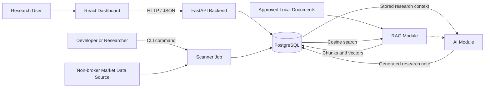
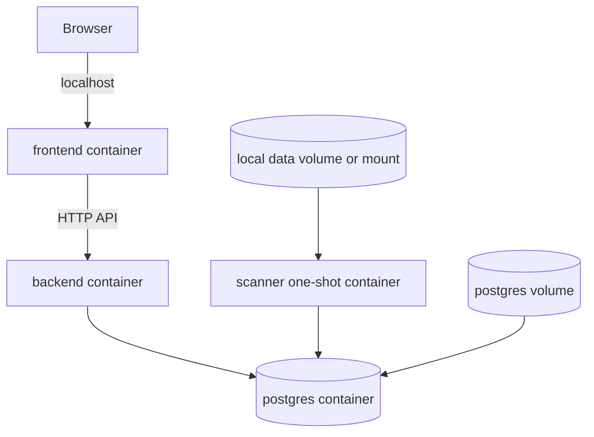

# AI Quant Research Platform

## System Design

### 1. High-Level Architecture

The MVP uses a small service-oriented architecture that runs locally with Docker
Compose:

- A React and TypeScript frontend provides the research dashboard.
- A FastAPI backend exposes versioned APIs for dashboard data.
- A Python scanner runs as a command-line job and persists scan results.
- PostgreSQL stores market data references, scan runs, and signal results.

The backend and scanner are separate runtime processes but share stable database
contracts and domain definitions. The MVP does not require a message broker,
workflow engine, vector database, or LLM service.

### 2. Main Modules

#### MVP Modules

- `backend/`: FastAPI application, API schemas, database access, and migrations.
- `frontend/`: React dashboard for scan history, results, filters, and charts.
- `scanner/`: CLI entry point, market-data ingestion and validation, indicators,
  signal rules, and scan persistence.
- `data/`: Local development fixtures, documented imports, and non-sensitive
  sample data.
- `deployment/`: Docker Compose and environment configuration.
- `tests/`: Cross-module, integration, and end-to-end tests.

#### Optional Extension Modules

- `ai/`: Implemented provider abstraction, prompt versioning, safety checks, and
  generated research notes.
- `rag/`: Implemented local document loading, chunking, embedding abstraction,
  indexing, and retrieval.

Each module owns a clear responsibility. Cross-module contracts should remain
small and explicit, especially database entities, API schemas, and signal
definitions.

### 3. Data Flow

#### Market Data Ingestion Flow

1. A researcher runs `ingest-asharehub` or `ingest-csv` locally or through the
   one-shot scanner container.
2. The selected provider reads stock metadata and daily OHLCV records.
3. The importer validates symbols, exchanges, dates, values, duplicate keys,
   OHLC relationships, and optional freshness expectations.
4. A single database transaction upserts stocks and daily prices.
5. The CLI returns inserted and updated counts plus structured warnings.

AShareHub is the primary Phase 3 provider. It supplies unadjusted daily data for
Shanghai, Shenzhen, and Beijing securities. The adapter normalizes volume from
lots to shares and amount from CNY thousands to CNY before persistence. It uses
explicit pagination and a per-run request budget to protect limited API quotas.

The initial `synthetic_csv_v1` fixture uses unadjusted synthetic prices,
synthetic CNY-denominated price and amount values, and volume measured in
shares. It remains the deterministic offline and automated-test provider.

#### Scan Flow

1. A researcher starts the scanner through a local command or one-shot Docker
   Compose command.
2. The scanner creates and commits a running scan record with its configuration
   and data date.
3. The scanner loads up to the required number of persisted daily bars for each
   selected stock.
4. Missing evaluated-date data and insufficient lookback are counted as
   warnings rather than valid non-matches.
5. Versioned technical indicators and signal rules are evaluated
   deterministically.
6. Results, matched values, warnings, and errors are stored in PostgreSQL.
7. The scan run is marked completed, completed with warnings, or failed.

The Phase 4 rule set contains:

- `moving_average_cross` version 1: detect a 5-day moving average crossing above
  or below the 20-day moving average.
- `recent_breakout` version 1: detect a close strictly above the highest price
  from the preceding 20 trading sessions.
- `volume_spike` version 1: detect volume at least 2 times the average from the
  preceding 20 trading sessions.

All three rules require 21 bars including the evaluated date. The rule
definitions and their parameters are immutable within a version. Signal
explanations are neutral research descriptions and contain no action guidance.

#### Dashboard Read Flow

1. The browser requests scan runs, results, stock details, or chart data from the
   FastAPI backend.
2. The backend validates query parameters and reads the required records from
   PostgreSQL.
3. The backend returns stable JSON response models.
4. The frontend renders scan status, filters, signal details, and historical
   stock charts.

The chart requests a bounded daily history and performs presentation-only
calendar aggregation for weekly and monthly views. MA5, MA10, MA20, MA30, and
MA60 are calculated over the currently selected bar level. Hover, crosshair,
zoom, and pan state remain local to the browser. Up to six recently searched or
opened stocks are stored in browser local storage as navigation shortcuts.
Intraday levels are not offered because the database and provider contract
currently store daily bars only.

The database is the integration point between the scanner and backend in the
MVP. They do not call each other directly.

#### Research Note Generation Flow

1. A caller requests a note for one stored stock and optionally one scanner run.
2. The backend loads the stock, a bounded daily-price window, and bounded
   technical-signal evidence from PostgreSQL.
3. The backend calculates a deterministic price summary and builds a versioned
   structured prompt.
4. The optional OpenAI-compatible provider returns note content.
5. The backend rejects empty, oversized, action-oriented, or guaranteed-outcome
   language before any write.
6. A successful note is stored with model, prompt, provider, limits, and source
   context metadata.

There is no document retrieval or agent orchestration in this flow.

#### Document Retrieval Flow

1. A user uploads an approved local text, Markdown, or text-based PDF document
   and confirms that it may be processed.
2. The backend extracts and normalizes text, computes a content hash, and
   returns an existing record when the content was already indexed.
3. The RAG module creates bounded overlapping chunks and generates embeddings
   through the configured provider.
4. PostgreSQL stores document lineage, chunk text, and fixed 256-dimensional
   vectors through pgvector.
5. A search query is embedded with the same provider and ranked using cosine
   distance.
6. The API returns relevant chunk text with document and chunk citations.

No web crawler, paid-report scraper, AI synthesis, or agent workflow participates
in this retrieval path.

### 4. Backend Responsibilities

The backend should:

- Expose versioned HTTP APIs for the frontend.
- Provide health and readiness endpoints.
- Return scan history, scan status, summary counts, and warnings.
- Return signal results with filtering and pagination.
- Return stock metadata and historical price data required for charts.
- Validate request parameters and return consistent error responses.
- Use SQLAlchemy for database access and migrations for schema evolution.
- Keep response contracts independent from internal ORM models.
- Enforce neutral research wording and expose no trading actions.
- Generate and retrieve optional research notes without coupling provider
  availability to ordinary read endpoints.

Phase 5 implements these responsibilities through Pydantic response contracts,
SQLAlchemy read queries, deterministic pagination, and a common error envelope
with request IDs. Canonical resources live under `/api/v1`; hidden unversioned
aliases call the same read handlers for local compatibility. Stock detail,
price, and signal routes use market symbols with an optional exchange
disambiguator rather than exposing internal database IDs in path navigation.

For the initial MVP, scanner execution remains a CLI operation. An API-triggered
job system can be added later if scheduling and background execution become a
validated requirement.

### 5. Scanner Responsibilities

The scanner should:

- Run independently as a Python command-line job.
- Import approved remote or documented local market data through a small
  provider-neutral interface.
- Validate a complete import batch before starting database writes.
- Upsert stock and daily-price records atomically and idempotently.
- Accept explicit scan configuration, such as data date, stock universe, and
  enabled signal definitions.
- Load data only from approved non-broker sources or local files.
- Validate data before calculating indicators.
- Apply deterministic, versioned, and testable technical signal rules.
- Distinguish a valid non-match from insufficient or invalid data.
- Create and update scan lifecycle records.
- Persist matched signals, relevant calculation values, summaries, and errors.
- Be idempotent where practical and rely on database constraints to prevent
  duplicate results.
- Exit with meaningful status codes and produce structured logs.

The scanner must not place orders, access brokerage accounts, or depend on the
frontend or backend being available.

The implementation commits the initial `running` record separately. Signal
definitions, detected matches, summary counts, and the terminal success state
are then committed together. A failure rolls back that second transaction and
updates the existing run to `failed` in a separate recovery transaction.

### 6. Frontend Responsibilities

The frontend should:

- Display recent and historical scan runs with clear statuses.
- Show matched stocks, signal types, calculation dates, and rule explanations.
- Filter and paginate results by date, stock, and signal.
- Display stock detail views with historical price and volume charts.
- Show which values caused a signal match.
- Surface missing-data warnings and scan failures without hiding uncertainty.
- Clearly show the effective market-data date and scan execution time.
- Use only backend APIs and never connect directly to PostgreSQL.
- Avoid directive, promotional, or personalized investment language.

The MVP frontend is a research viewer. It does not need AI chat, document search,
portfolio execution, or real-time streaming updates.

Phase 6 implements this viewer as one responsive React page with three primary
regions: paginated stock selection, a selected-stock research area, and recent
scanner-run history. The research area contains a dependency-free SVG daily
K-line and volume chart plus stored technical-signal evidence. A typed fetch
client consumes only `/api/v1` contracts. Loading, empty, retry, backend-error,
and narrow-screen states are handled without inventing missing market data or
signal conclusions.

### 7. Database Responsibilities

PostgreSQL is the system of record for the MVP. It should store:

- Stock and exchange metadata.
- Historical price and volume data, or references to managed market data.
- Signal definitions and their versions.
- Scan runs, configuration snapshots, status, timestamps, and summaries.
- Per-stock signal results and the calculation values supporting each match.
- Data-quality warnings and scan errors.
- Optional generated research notes and their source-context provenance.

Database design should provide:

- Primary and foreign keys that preserve traceability.
- Unique constraints that prevent duplicate scan results.
- Indexes for common date, stock, scan, and signal filters.
- Transactions so scan status and result writes remain consistent.
- Schema migrations tracked with the application.
- A persistent Docker volume for local development.

Detailed entities and relationships belong in `03_database_design.md`.

### 8. AI Module Responsibilities

The `ai/` module remains optional and is isolated from the Phase 1-6 MVP. Phase
7 implements:

- An OpenAI-compatible interface independent of a specific model provider.
- Versioned prompts built only from stored stock metadata, bounded price
  summaries, and detected technical signals.
- Neutral note generation with timeout, retry, output-size, and language
  controls.
- Persistence of model identity, prompt version, provider metadata, and the
  exact structured context used for generation.
- Retrieval of stored notes while the model provider is disabled or
  unavailable.

The provider is disabled by default. Generation fails independently without
affecting ingestion, scanning, API reads, or the dashboard. RAG and LangGraph
remain separate future phases.

AI output must remain informational research. It must not initiate scans,
modify source data, execute trades, connect to brokers, or present personalized
investment direction.

### 9. RAG Module Responsibilities

The `rag/` module is optional and isolated from the Phase 1-6 MVP. Phase 8
implements:

- Local ingestion of approved `.txt`, `.md`, and text-based `.pdf` documents.
- Normalization, deterministic chunking, content-hash deduplication, and source
  lineage.
- A provider-neutral embedding interface with offline local and
  OpenAI-compatible implementations.
- pgvector cosine search with document type and stock filters.
- Source-aware results with stable document, chunk, and stock citations.
- Document deletion with cascading chunk removal.

The default local embedding is deliberately lightweight and primarily useful
for local development. External embedding quality and cost remain provider
concerns. RAG does not automatically feed Phase 7 notes yet; that integration
requires a separately reviewed grounding contract.

### 10. Deployment Architecture

The MVP runs locally with Docker Compose using these services:

- `postgres`: PostgreSQL with a named persistent volume and health check.
- `backend`: FastAPI service connected to PostgreSQL through environment
  configuration.
- `frontend`: React development or static-serving container configured to call
  the backend API.
- `scanner`: One-shot container invoked on demand with the same database
  connection and approved data configuration.

Phase 7 does not add a separate AI container. The backend calls a configured
OpenAI-compatible HTTPS endpoint only for explicit generation requests.

Phase 8 replaces the plain PostgreSQL 17 image with the matching official
`pgvector/pgvector:pg17` image while retaining the same persistent volume. It
does not add a separate vector-database service.

Configuration should be supplied through environment variables and example
files. Secrets must not be committed. Containers should use health checks and
startup dependencies, while database migrations should run as an explicit,
repeatable step.

Production orchestration, cloud infrastructure, autoscaling, and high
availability are outside the MVP.

### 11. Key Design Trade-Offs

#### Database as the Integration Boundary

Using PostgreSQL between the scanner and backend avoids a queue and background
worker framework. This is simple and observable for local use, but requires
careful schema ownership and transactions.

#### CLI Scanner Before Job Orchestration

A CLI job is easy to test, rerun, and invoke through Docker Compose. It does not
provide scheduling or live progress events; those should be added only after the
core scan workflow is stable.

#### Modular Monorepo Before Microservices

Separate directories and runtime processes preserve clear ownership without the
deployment and operational cost of independently managed services. Modules can
be extracted later if scale or team boundaries justify it.

#### Batch Data Before Real-Time Data

Daily or historical batch data supports reproducible research and lowers
complexity. Real-time streaming would add state, latency, and reliability
requirements that do not serve the MVP.

#### Provider Interface with Local Fallback

The provider interface keeps remote acquisition separate from validation and
persistence. AShareHub supplies practical daily market coverage, while the
strict local CSV provider preserves reproducible tests and offline workflows.
Every provider must document units, adjustment conventions, provenance, quota
behavior, and usage constraints.

#### Explicit Signal Rules Before User-Defined Logic

A small set of versioned rules is easier to validate and explain. A rule builder
or plugin system can be introduced after stable signal contracts exist.

#### REST APIs Before More Complex Interfaces

REST with JSON is sufficient for dashboard queries and straightforward to test.
GraphQL, WebSockets, or event streams are unnecessary until concrete access
patterns require them.

#### Deferred AI and RAG

Keeping AI and RAG outside the MVP allows the team to establish trustworthy data
and signal foundations first. Their future interfaces should consume documented
research data without becoming dependencies of the scanner or core dashboard.
