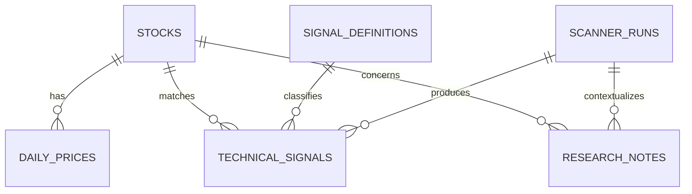

# AI Quant Research Platform

## Database Design

### 1. Scope and Principles

PostgreSQL is the MVP system of record for stock metadata, daily K-line data,
scanner history, and detected technical signals. A simple research-notes table
is reserved for a future AI phase but is not required to run the MVP.

The schema follows these principles:

- Optimize for daily batch research, not real-time or high-frequency trading.
- Preserve enough context to reproduce and explain every detected signal.
- Use ordinary relational tables, constraints, and indexes before specialized
  time-series or partitioning features.
- Store timestamps as `TIMESTAMPTZ` and market trading days as `DATE`.
- Use `NUMERIC` for prices and traded amounts to avoid floating-point rounding.
- Keep flexible configuration and calculated values in bounded `JSONB` fields.
- Store no brokerage accounts, orders, positions, or execution data.

### 2. Entity Relationships

### 3. Table: `stocks`

Stores one record for each supported A-share security.

| Field | Type | Constraints | Description |
|---|---|---|---|
| `id` | `BIGINT` | Primary key, generated identity | Internal stable identifier |
| `symbol` | `VARCHAR(16)` | Not null | Exchange-local code such as `600519` |
| `exchange` | `VARCHAR(8)` | Not null | Exchange code such as `SSE`, `SZSE`, or `BSE` |
| `name` | `VARCHAR(128)` | Not null | Display name |
| `list_date` | `DATE` | Nullable | Listing date when known |
| `delist_date` | `DATE` | Nullable | Delisting date when applicable |
| `status` | `VARCHAR(16)` | Not null, default `active` | `active`, `suspended`, or `delisted` |
| `created_at` | `TIMESTAMPTZ` | Not null | Record creation time |
| `updated_at` | `TIMESTAMPTZ` | Not null | Last metadata update time |

**Keys and constraints**

- Primary key: `id`
- Unique constraint: (`exchange`, `symbol`)
- Check constraint: `delist_date` is null or not earlier than `list_date`

**Index suggestions**

- Unique B-tree index on (`exchange`, `symbol`) for exact lookup.
- B-tree index on `name` if name filtering becomes common.
- B-tree index on `status` only if inactive stocks form a meaningful subset.

**Example record**

| `id` | `symbol` | `exchange` | `name` | `list_date` | `delist_date` | `status` |
|---:|---|---|---|---|---|---|
| 1 | `600519` | `SSE` | `Kweichow Moutai` | `2001-08-27` | null | `active` |

### 4. Table: `daily_prices`

Stores canonical daily OHLCV records used by charts and signal calculations.
All records for a given dataset must use a documented and consistent price
adjustment convention.

The initial `synthetic_csv_v1` development source uses unadjusted synthetic
prices, synthetic CNY-denominated price and amount values, and volume measured
in shares. These records are fixtures rather than market statements.

| Field | Type | Constraints | Description |
|---|---|---|---|
| `id` | `BIGINT` | Primary key, generated identity | Internal row identifier |
| `stock_id` | `BIGINT` | Not null, foreign key | References `stocks.id` |
| `trade_date` | `DATE` | Not null | Market trading date |
| `open` | `NUMERIC(18,4)` | Not null | Opening price |
| `high` | `NUMERIC(18,4)` | Not null | Highest price |
| `low` | `NUMERIC(18,4)` | Not null | Lowest price |
| `close` | `NUMERIC(18,4)` | Not null | Closing price |
| `volume` | `BIGINT` | Not null | Traded volume in the source's documented unit |
| `amount` | `NUMERIC(24,4)` | Nullable | Traded monetary amount |
| `source` | `VARCHAR(64)` | Not null | Non-broker data-source identifier |
| `created_at` | `TIMESTAMPTZ` | Not null | Initial ingestion time |
| `updated_at` | `TIMESTAMPTZ` | Not null | Last corrected or refreshed time |

**Keys and constraints**

- Primary key: `id`
- Foreign key: `stock_id` references `stocks.id` with delete restricted
- Unique constraint: (`stock_id`, `trade_date`)
- Check constraints:
  - OHLC prices are non-negative.
  - `volume` is non-negative.
  - `high` is greater than or equal to `open`, `low`, and `close`.
  - `low` is less than or equal to `open`, `high`, and `close`.

**Index suggestions**

- Unique B-tree index on (`stock_id`, `trade_date`).
- B-tree index on `trade_date` for market-wide date queries.
- No time-based partitioning for the MVP; add it only if measured data volume
  or maintenance cost justifies it.

**Example record**

| `id` | `stock_id` | `trade_date` | `open` | `high` | `low` | `close` | `volume` | `amount` | `source` |
|---:|---:|---|---:|---:|---:|---:|---:|---:|---|
| 1001 | 1 | `2026-06-12` | 1410.0000 | 1432.5000 | 1402.1000 | 1426.8000 | 3254100 | 4625180000.0000 | `sample_daily_feed` |

The values above are illustrative fixture data, not a market statement.

### 5. Table: `signal_definitions`

Stores the identity and version of each deterministic technical signal. Keeping
definitions separate from matches allows historical runs to remain traceable
when a rule changes.

| Field | Type | Constraints | Description |
|---|---|---|---|
| `id` | `BIGINT` | Primary key, generated identity | Signal-version identifier |
| `code` | `VARCHAR(64)` | Not null | Stable machine-readable signal code |
| `version` | `INTEGER` | Not null | Positive rule version |
| `name` | `VARCHAR(128)` | Not null | Human-readable signal name |
| `description` | `TEXT` | Not null | Neutral explanation of the rule |
| `parameters` | `JSONB` | Not null, default `{}` | Documented calculation parameters |
| `is_active` | `BOOLEAN` | Not null, default `true` | Whether new scans may use this version |
| `created_at` | `TIMESTAMPTZ` | Not null | Definition creation time |

**Keys and constraints**

- Primary key: `id`
- Unique constraint: (`code`, `version`)
- Check constraint: `version` is greater than zero

**Index suggestions**

- Unique B-tree index on (`code`, `version`).
- Optional partial index on `code` where `is_active = true` if active-definition
  lookup becomes frequent.

**Example record**

| `id` | `code` | `version` | `name` | `parameters` | `is_active` |
|---:|---|---:|---|---|---|
| 10 | `ma_cross_up` | 1 | `Moving Average Upward Cross` | `{"short_window": 5, "long_window": 20}` | true |

### 6. Table: `scanner_runs`

Stores the lifecycle, configuration, and summary of each CLI scanner execution.

| Field | Type | Constraints | Description |
|---|---|---|---|
| `id` | `UUID` | Primary key | Scanner-run identifier generated by the application |
| `status` | `VARCHAR(32)` | Not null | Run lifecycle state |
| `data_date` | `DATE` | Not null | Latest market date evaluated by the run |
| `universe_name` | `VARCHAR(128)` | Not null | Human-readable stock-universe name |
| `parameters` | `JSONB` | Not null, default `{}` | Signal codes, versions, and other run configuration |
| `started_at` | `TIMESTAMPTZ` | Not null | Execution start time |
| `finished_at` | `TIMESTAMPTZ` | Nullable | Execution completion time |
| `total_stocks` | `INTEGER` | Not null, default `0` | Stocks selected for evaluation |
| `processed_stocks` | `INTEGER` | Not null, default `0` | Stocks successfully evaluated |
| `matched_stocks` | `INTEGER` | Not null, default `0` | Distinct stocks with at least one match |
| `warning_count` | `INTEGER` | Not null, default `0` | Data-quality or non-fatal warning count |
| `error_count` | `INTEGER` | Not null, default `0` | Processing error count |
| `error_message` | `TEXT` | Nullable | Concise run-level failure summary |
| `created_at` | `TIMESTAMPTZ` | Not null | Record creation time |

**Keys and constraints**

- Primary key: `id`
- Check constraint: `status` is one of `pending`, `running`, `completed`,
  `completed_with_warnings`, or `failed`
- Check constraints: all count fields are non-negative
- Check constraint: `finished_at` is null or not earlier than `started_at`

**Index suggestions**

- B-tree index on `started_at` descending for scan-history pages.
- B-tree index on (`data_date`, `status`) for date and state filtering.
- A `JSONB` GIN index is not needed for the MVP unless configuration searches
  become a demonstrated use case.

**Example record**

| Field | Example value |
|---|---|
| `id` | `c62d4313-9199-4f27-a8f7-c64284e78792` |
| `status` | `completed_with_warnings` |
| `data_date` | `2026-06-12` |
| `universe_name` | `a_share_sample` |
| `parameters` | `{"signals": [{"code": "ma_cross_up", "version": 1}]}` |
| `started_at` | `2026-06-13T02:00:00Z` |
| `finished_at` | `2026-06-13T02:03:18Z` |
| `total_stocks` | `100` |
| `processed_stocks` | `98` |
| `matched_stocks` | `7` |
| `warning_count` | `2` |
| `error_count` | `0` |

### 7. Table: `technical_signals`

Stores positive signal matches produced by scanner runs. Valid non-matches are
represented by run summary counts rather than one row per stock and rule.

The implementation uses `technical_signals` as the table name to match the
Phase 2 domain terminology. It has the same role as the earlier
`detected_signals` proposal.

| Field | Type | Constraints | Description |
|---|---|---|---|
| `id` | `UUID` | Primary key | Detected-signal identifier |
| `scanner_run_id` | `UUID` | Not null, foreign key | References `scanner_runs.id` |
| `stock_id` | `BIGINT` | Not null, foreign key | References `stocks.id` |
| `signal_definition_id` | `BIGINT` | Not null, foreign key | References `signal_definitions.id` |
| `signal_date` | `DATE` | Not null | Trading date on which the rule matched |
| `matched_values` | `JSONB` | Not null, default `{}` | Indicator values supporting the match |
| `explanation` | `TEXT` | Not null | Neutral, deterministic match explanation |
| `created_at` | `TIMESTAMPTZ` | Not null | Persistence time |

**Keys and constraints**

- Primary key: `id`
- Foreign key: `scanner_run_id` references `scanner_runs.id`
- Foreign key: `stock_id` references `stocks.id` with delete restricted
- Foreign key: `signal_definition_id` references `signal_definitions.id` with
  delete restricted
- Unique constraint:
  (`scanner_run_id`, `stock_id`, `signal_definition_id`, `signal_date`)

Deleting a scanner run may cascade to its detected signals if deletion is
explicitly supported. Normal application behavior should preserve scan history.

**Index suggestions**

- B-tree index on (`scanner_run_id`, `signal_date`) for run-detail pages.
- B-tree index on (`stock_id`, `signal_date` descending) for stock history.
- B-tree index on (`signal_definition_id`, `signal_date` descending) for signal
  filtering.
- No GIN index on `matched_values` for the MVP because it is displayed as
  evidence rather than used as a primary filter.

**Example record**

| Field | Example value |
|---|---|
| `id` | `9a694b1c-255b-4708-b47b-f0e35b2ad1f0` |
| `scanner_run_id` | `c62d4313-9199-4f27-a8f7-c64284e78792` |
| `stock_id` | `1` |
| `signal_definition_id` | `10` |
| `signal_date` | `2026-06-12` |
| `matched_values` | `{"ma_5": 1418.42, "ma_20": 1415.08, "previous_ma_5": 1412.10, "previous_ma_20": 1413.72}` |
| `explanation` | `The 5-day moving average crossed above the 20-day moving average on the evaluated date.` |

This record describes a rule match for research inspection. It is not an action
or recommendation.

### 8. Future Table: `research_notes`

This table is reserved for a future phase that stores manual or AI-generated
research summaries. It is not required by the MVP and should not be created
until the feature is implemented.

| Field | Type | Constraints | Description |
|---|---|---|---|
| `id` | `UUID` | Primary key | Research-note identifier |
| `stock_id` | `BIGINT` | Nullable, foreign key | Optional reference to `stocks.id` |
| `scanner_run_id` | `UUID` | Nullable, foreign key | Optional reference to `scanner_runs.id` |
| `title` | `VARCHAR(256)` | Not null | Note title |
| `content` | `TEXT` | Not null | Informational research content |
| `source_type` | `VARCHAR(32)` | Not null | `manual` or `ai_generated` |
| `model_name` | `VARCHAR(128)` | Nullable | Model identifier for generated content |
| `prompt_version` | `VARCHAR(64)` | Nullable | Prompt or workflow version |
| `metadata` | `JSONB` | Not null, default `{}` | Citations, generation settings, or provenance |
| `created_at` | `TIMESTAMPTZ` | Not null | Note creation time |
| `updated_at` | `TIMESTAMPTZ` | Not null | Last note update time |

**Keys and constraints**

- Primary key: `id`
- Foreign key: `stock_id` references `stocks.id` with delete restricted
- Foreign key: `scanner_run_id` references `scanner_runs.id` with delete
  restricted
- Check constraint: `source_type` is `manual` or `ai_generated`
- At least one of `stock_id` or `scanner_run_id` should be present
- `model_name` and `prompt_version` should be populated for AI-generated notes

**Index suggestions**

- B-tree index on (`stock_id`, `created_at` descending).
- B-tree index on (`scanner_run_id`, `created_at` descending).
- Full-text or vector indexes are deferred until search requirements are
  documented.

**Example record**

| Field | Example value |
|---|---|
| `id` | `b9572374-b8da-4d22-bbf3-91a8d0c97a97` |
| `stock_id` | `1` |
| `scanner_run_id` | `c62d4313-9199-4f27-a8f7-c64284e78792` |
| `title` | `Scan result summary for 2026-06-12` |
| `content` | `Informational summary of the stored signal values and data-quality context.` |
| `source_type` | `ai_generated` |
| `model_name` | `openai-compatible-model` |
| `prompt_version` | `research-summary-v1` |

### 9. Design Rationale

#### Surrogate Keys with Domain Uniqueness

Generated `BIGINT` and application-generated `UUID` primary keys keep
relationships stable, while unique constraints enforce domain rules such as one
daily record per stock and date.

#### Separate Signal Definitions and Matches

Signal logic will evolve. Referencing a versioned definition ensures a
historical match remains explainable without copying the full rule into every
result row.

#### `JSONB` for Bounded Variable Data

Scanner parameters and matched indicator values vary by signal. `JSONB` avoids
frequent schema changes while core searchable fields remain relational. These
documents should stay small, validated by the application, and versioned through
their surrounding records.

#### Positive Matches Only

Persisting every non-match would grow the database without improving the main
dashboard workflow. Run-level counts provide coverage information, while
detected matches retain detailed evidence.

#### No Premature Time-Series Optimization

Daily A-share data is manageable with a composite B-tree index. Partitioning,
TimescaleDB, compression, and read replicas should be considered only after
measurement shows a real need.

#### Future Notes Without MVP Dependencies

The research-notes shape records provenance needed for future generated content,
but the MVP scanner, backend, database migrations, and dashboard must not depend
on it.

### 10. Migration and Data Integrity Guidance

- Manage schema changes through version-controlled SQLAlchemy migrations.
- Apply migrations explicitly before starting the backend or scanner.
- Write daily-price imports as upserts keyed by (`stock_id`, `trade_date`).
- Wrap scanner-run status updates and result writes in transactions.
- Preserve completed scanner runs and their signal definitions for auditability.
- Use UTC for system timestamps and exchange-local dates for `trade_date`.
- Keep fixture records synthetic or clearly labeled as illustrative.
- Add retention or archival policies only after actual storage requirements are
  measured.
