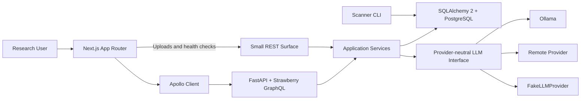

# AI Quant Research Platform

## Next.js and GraphQL Migration Plan

### 1. Purpose

This plan migrates the existing React/Vite and REST-based application toward a
portfolio-ready implementation centered on:

- React, TypeScript, and Next.js App Router
- Tailwind CSS and shadcn/ui
- React Hook Form and Zod
- Apollo Client and GraphQL Code Generator
- FastAPI and Strawberry GraphQL
- Pydantic, SQLAlchemy 2, Alembic, psycopg 3, and PostgreSQL
- Ollama, one remote provider, provider-neutral contracts, and deterministic
  fake providers
- Vitest, React Testing Library, MSW, Playwright, pytest, pytest-asyncio,
  Testcontainers, and coverage reporting
- pnpm, uv, Docker Compose, GitHub Actions, ESLint, Prettier, Ruff, and mypy

The primary goal is to demonstrate practical competence with these technologies
without turning the repository into a collection of unused dependencies. Every
technology must support a documented user workflow or engineering requirement.

The platform remains strictly for research and education. This migration does
not add broker connectivity, order execution, or investment recommendations.

### 2. Target Architecture

The intended API boundary is:

- GraphQL for application queries and mutations.
- REST for liveness, readiness, file upload/download, and operational endpoints
  where GraphQL adds no value.
- Shared application services below both transports. GraphQL resolvers must not
  call REST route functions, and REST route functions must not call resolvers.

### 3. Migration Principles

1. Keep the application runnable at the end of every phase.
2. Migrate one end-to-end workflow at a time instead of rewriting all layers at
   once.
3. Reuse domain, repository, scanner, and safety logic; replace transport and UI
   boundaries around them.
4. Keep REST available until its equivalent GraphQL workflow is tested in the
   frontend and end-to-end suite.
5. Keep generated GraphQL code deterministic and never hand-edit it.
6. Use explicit Strawberry API types. Use Pydantic for validation, settings,
   service contracts, and structured LLM outputs.
7. Keep core relational fields in normal PostgreSQL columns. Use JSONB only for
   variable metadata, signal parameters, and evidence.
8. Treat RAG as an optional feature, while acknowledging that the current
   development database image and migrations already include pgvector.
9. Add tests and documentation in the same phase as each behavior change.
10. Do not remove a working implementation until its replacement meets the
    phase acceptance criteria.

### 4. Phase 0: Stabilize the Existing Baseline

**Implementation status (September 6, 2026):** Completed on the migration
branch. Formatting and type-check failures were repaired, settings tests were
isolated from the local dotenv file, the non-database suite passed, all 115
Python tests passed against a disposable pgvector-enabled PostgreSQL 17
container, and the migration decision and baseline were documented.

#### Goal

Start the migration from a reproducible green baseline so later failures can be
attributed to migration changes.

#### Tasks

- Fix current Ruff, Prettier, and mypy failures without changing behavior.
- Make settings tests independent of the developer's local `.env` file.
- Run all non-PostgreSQL tests deterministically.
- Start a disposable PostgreSQL instance and run all migration, repository, API,
  scanner, and RAG integration tests.
- Record current frontend bundle size and the principal user workflows.
- Add a short architecture decision record confirming the target stack, hybrid
  REST/GraphQL boundary, and incremental migration strategy.

#### Acceptance Criteria

- `bash test.sh all` passes from a clean checkout.
- PostgreSQL integration tests pass against the pgvector-enabled PostgreSQL
  image.
- The worktree is clean after running all checks.
- The architecture decision is documented before transport or UI contracts
  change.

#### Rollback Point

No architecture has changed. Reverting this phase restores the original code
with no data migration.

### 5. Phase 1: Migrate Package Management and Establish CI

#### Goal

Create the repeatable engineering foundation used by every later phase.

#### Tasks

- Replace npm commands and `package-lock.json` with pnpm and `pnpm-lock.yaml`.
- Add the `packageManager` field and document the supported Node.js version.
- Replace pip-tools installation instructions and `requirements.lock` with uv
  project management and `uv.lock`.
- Update setup scripts, test scripts, Dockerfiles, Compose commands, and README
  examples to use pnpm and uv.
- Add GitHub Actions jobs for Python quality checks, frontend quality checks,
  PostgreSQL integration tests, and container builds.
- Cache pnpm and uv artifacts without caching generated application data.
- Add coverage collection, initially reporting current coverage without imposing
  an arbitrary high threshold.

#### Acceptance Criteria

- A fresh checkout can be installed with `uv sync --frozen` and
  `pnpm install --frozen-lockfile`.
- Local scripts and CI execute the same lint, format, type-check, and test
  commands.
- Only one Python lock file and one frontend lock file remain authoritative.
- All GitHub Actions jobs pass.

#### Rollback Point

Application runtime behavior and API contracts are unchanged.

### 6. Phase 2: Migrate Vite to Next.js App Router

#### Goal

Move the existing interface to Next.js while continuing to use the current REST
API, isolating frontend framework migration from API migration.

#### Tasks

- Replace the Vite entry point with a Next.js App Router application.
- Introduce route groups and layouts for:
  - `/` dashboard summary
  - `/stocks/[exchange]/[symbol]` stock research
  - `/scanner-runs/[runId]` scanner-run detail
  - `/documents` document search and ingestion
  - `/research-notes` generated research notes
- Split the current large `App.tsx` into route-level features and focused
  components.
- Keep the K-line chart and other browser-dependent interactions in explicit
  Client Components.
- Use Server Components for shells and read-only initial data only where doing so
  simplifies the implementation.
- Define separate browser-visible and container-internal backend URLs.
- Update Docker Compose, frontend health checks, CORS settings, and documentation
  for the Next.js development and production ports.
- Preserve all current loading, empty, error, retry, responsive, chart, and local
  recent-stock behaviors.

#### Acceptance Criteria

- Every existing frontend workflow works through the unchanged REST API.
- Direct navigation and refresh work on every documented route.
- No server component imports browser-only APIs.
- Frontend lint, formatting, type checks, unit tests, and production build pass.
- Docker Compose starts the Next.js frontend and existing backend together.

#### Rollback Point

The backend and database remain unchanged. The previous Vite implementation can
be restored without data migration.

### 7. Phase 3: Introduce Tailwind CSS, shadcn/ui, and Form Infrastructure

#### Goal

Build a maintainable component and form foundation before adding new API-driven
features.

#### Tasks

- Configure Tailwind CSS and define project color, spacing, typography, chart,
  focus, error, warning, and success tokens.
- Initialize shadcn/ui and add only components used by an implemented screen.
- Build shared application primitives such as page headers, empty states, error
  panels, loading skeletons, data tables, dialogs, filters, and toasts.
- Convert existing global CSS incrementally; retain specialized SVG chart CSS
  where utility classes would reduce clarity.
- Add React Hook Form and Zod.
- Implement reusable form-field adapters with accessible labels, descriptions,
  validation messages, keyboard behavior, and focus management.
- Migrate date-range, signal filtering, document upload, and future scan
  configuration forms to React Hook Form and Zod.
- Keep Zod schemas at the feature boundary; do not duplicate GraphQL response
  types manually.

#### Acceptance Criteria

- Existing screens use documented design tokens and shared UI primitives.
- Every migrated form has success, validation, submission-error, and disabled
  states covered by tests.
- Keyboard navigation and accessible names are verified with React Testing
  Library.
- Unused shadcn/ui components and unused form dependencies are not added.

#### Rollback Point

API and database contracts remain unchanged. UI components can be reverted one
feature at a time.

### 8. Phase 4: Define and Mount the Strawberry GraphQL Foundation

#### Goal

Establish a typed GraphQL contract without changing frontend production traffic.

#### Tasks

- Update system and API design documents with the GraphQL schema conventions,
  error model, pagination model, and retained REST endpoints.
- Add `backend/app/graphql/` modules for schema composition, context, scalars,
  query roots, mutation roots, errors, and DataLoaders.
- Mount Strawberry's GraphQL router at `/graphql`.
- Define explicit scalars for `Date`, `DateTime`, `Decimal`, and JSON-like
  metadata. Represent database identifiers safely for JavaScript clients.
- Define typed domain errors for expected failures and sanitized GraphQL error
  extensions for unexpected failures.
- Add query depth, alias, page-size, date-range, and complexity limits.
- Disable production GraphQL IDE/introspection if the deployment model later
  requires it; keep developer tooling convenient in local environments.
- Decide and document the database concurrency boundary:
  - preferred target: async FastAPI GraphQL resolvers with SQLAlchemy
    `AsyncSession` and psycopg 3;
  - scanner CLI may retain synchronous sessions;
  - blocking database or provider calls must never run directly on the event
    loop.
- Export a deterministic `schema.graphql` artifact without requiring a live
  backend in frontend CI.

#### Acceptance Criteria

- `/graphql` serves a version/capabilities query and returns sanitized errors.
- Schema export is deterministic and checked in CI.
- Resolver tests cover context lifetime, validation, expected errors, and
  unexpected error masking.
- Existing REST API behavior remains unchanged.

#### Rollback Point

Removing the GraphQL router restores the previous backend; no frontend or
database contract depends on it yet.

### 9. Phase 5: Migrate Read Workflows as Vertical GraphQL Slices

#### Goal

Prove GraphQL value through complete user workflows rather than endpoint-by-
endpoint mechanical translation.

#### Slice Order

1. Stock search and stock reference data.
2. Stock detail with bounded price history and technical signals.
3. Scanner-run list, scanner-run detail, and matched signals.
4. Research-note history.
5. Document metadata and document search results.

#### Tasks for Each Slice

- Add a documented GraphQL query and explicit Strawberry result types.
- Reuse or extract an application service shared with REST.
- Batch related stock, signal-definition, run, and document lookups with
  DataLoaders or set-oriented repository queries.
- Add cursor pagination where lists can grow; retain deterministic ordering.
- Prevent unbounded OHLCV queries and record query-count tests for nested data.
- Add resolver unit tests and PostgreSQL integration tests.
- Keep the matching REST endpoint until the Apollo-powered frontend slice is
  complete.

#### Acceptance Criteria

- Each query returns only documented research data and provenance.
- Nested queries have bounded database query counts and no ORM lazy-loading
  surprises.
- Pagination is stable when records share dates or timestamps.
- REST and GraphQL return equivalent domain results during the transition.

#### Rollback Point

Each slice can be disabled independently while the corresponding REST endpoint
remains available.

### 10. Phase 6: Add Apollo Client and GraphQL Code Generator

#### Goal

Replace handwritten frontend API types and requests with generated, cache-aware
GraphQL operations.

#### Tasks

- Install Apollo Client, the supported Next.js integration, GraphQL, and GraphQL
  Code Generator.
- Configure the Code Generator client preset against the exported schema.
- Map custom scalars explicitly and enable strict handling of unknown scalars.
- Co-locate named queries and fragments with their route-level features.
- Configure Apollo cache identities and list pagination policies.
- Define separate Apollo clients for server-request scope and browser scope when
  both are required.
- Add MSW GraphQL handlers for loading, success, partial-data, domain-error, and
  transport-error cases.
- Migrate the read slices in the same order as Phase 5.
- Add a CI check that regenerates artifacts and fails on schema/codegen drift.
- Remove handwritten response types only after their final consumer has
  migrated.

#### Acceptance Criteria

- No migrated feature hand-writes the shape of a GraphQL response.
- Client and server rendering do not share user-specific Apollo cache state.
- Cache updates and pagination behavior are deterministic and tested.
- The application retains useful error messages and request correlation data.
- Production build and hydration complete without warnings.

#### Rollback Point

Unmigrated and disabled slices continue to use the existing REST client.

### 11. Phase 7: Migrate Mutations and Complete Form Workflows

#### Goal

Exercise React Hook Form, Zod, GraphQL mutations, validation, and Apollo cache
updates through meaningful write workflows.

#### Mutation Order

1. Synchronize a bounded stock price range.
2. Generate a research note from stored context.
3. Delete an approved knowledge document.
4. Trigger a research scan only after the existing scanner service boundary and
   lifecycle are documented for web invocation.

Document upload remains REST multipart unless a later decision record proves a
GraphQL upload implementation is necessary and safe.

#### Tasks

- Define Pydantic service commands and explicit Strawberry mutation inputs.
- Return typed success and expected-error results rather than parsing exception
  strings in the frontend.
- Connect React Hook Form and Zod forms to generated mutation documents.
- Update or invalidate Apollo cache entries intentionally after successful
  mutations.
- Use optimistic UI only for reversible, deterministic operations. Do not use it
  for scans, provider calls, or report generation.
- Add duplicate-submission protection, cancellation behavior where supported,
  and visible provider/database failure states.

#### Acceptance Criteria

- Server-side validation remains authoritative even when Zod validates in the
  browser.
- Every mutation has success, invalid-input, conflict, unavailable-provider, and
  database-failure tests where applicable.
- Generated research remains labeled informational and cannot initiate trading
  behavior.

#### Rollback Point

Equivalent REST mutations remain available until frontend and E2E acceptance
tests pass.

### 12. Phase 8: Generalize the LLM Provider Layer

#### Goal

Demonstrate provider abstraction and Pydantic structured outputs with local,
remote, and deterministic implementations.

#### Tasks

- Replace the research-note-specific generator boundary with a small
  provider-neutral LLM request/response contract.
- Implement:
  - `OllamaProvider`
  - one OpenAI-compatible remote provider
  - `FakeLLMProvider`
- Define Pydantic structured-output models for research summaries,
  observations, limitations, evidence references, and provenance.
- Send provider-supported JSON Schema and always validate returned content with
  Pydantic.
- Record provider, model, prompt version, schema version, parameters, latency,
  token usage when available, and source context.
- Preserve timeout, retry, maximum-output, safety-language, and disabled-provider
  controls.
- Add an optional Ollama Docker Compose profile and persistent model volume.
  Core application startup must not require Ollama.
- Run the same provider contract suite against the fake and transport-mocked
  provider implementations. Keep live-provider tests opt-in.

#### Acceptance Criteria

- Domain services can switch providers through configuration without changing
  report logic.
- Malformed, incomplete, oversized, unsafe, and schema-invalid output is rejected
  visibly.
- Default CI never requires network access, paid services, or a locally installed
  model.
- The platform remains usable with AI disabled.

#### Rollback Point

Provider selection is feature-gated and does not affect scanning or read-only
research workflows.

### 13. Phase 9: Add PostgreSQL Full Text Search Deliberately

#### Goal

Add a portfolio-worthy PostgreSQL search implementation without misusing JSONB
or duplicating vector search.

#### Tasks

- Document search targets separately: stock symbol/name, document title, document
  content, research-note content, and structured metadata filters.
- Benchmark current `ILIKE` and vector-only behavior with a deterministic fixture
  set.
- Decide and document the Chinese-language tokenization strategy before creating
  production FTS indexes.
- Add generated or maintained `tsvector` fields and GIN indexes only for approved
  text-search targets.
- Consider `pg_trgm` for fuzzy stock/name/title search.
- Add JSONB GIN or expression indexes only for metadata keys used by real
  queries.
- Keep OHLCV records relational; do not move price series into JSONB.
- Combine lexical and vector results only after defining a deterministic hybrid
  ranking and evaluation dataset.
- Implement all extension and index changes through reversible Alembic
  migrations.

#### Acceptance Criteria

- Search tests cover Chinese text, symbols, mixed-language text, filters,
  ranking, empty queries, and special characters.
- Query plans demonstrate use of intended indexes on representative fixtures.
- Migration upgrade and downgrade pass against the same PostgreSQL image used in
  development.
- pgvector remains isolated to RAG behavior and cannot break core scanning when
  RAG is disabled.

#### Rollback Point

Search migrations are reversible and the previous search method remains
available until relevance tests pass.

### 14. Phase 10: Complete the Test Pyramid and Delivery Workflow

#### Goal

Make the final architecture independently reproducible and demonstrable.

#### Tasks

- Use Vitest and React Testing Library for components, hooks, form behavior, and
  Apollo cache policies.
- Use MSW for GraphQL and retained REST network boundaries.
- Add Playwright coverage for these critical workflows:
  1. search for a stock and inspect a chart and signals;
  2. open a scanner run and filter matched signals;
  3. submit and validate a research form;
  4. upload, search, cite, and delete an approved document;
  5. generate a fake-provider research note and inspect provenance.
- Use pytest and pytest-asyncio for service, resolver, and API behavior.
- Replace environment-variable-dependent PostgreSQL skips with a session-scoped
  Testcontainers fixture using the pgvector PostgreSQL image.
- Keep unit tests fast and do not start a container for tests that do not require
  PostgreSQL behavior.
- Add coverage thresholds based on the established baseline and raise them
  incrementally for changed modules.
- Add schema drift, migration, Docker Compose config, production build, and E2E
  jobs to GitHub Actions.

#### Acceptance Criteria

- Default CI is deterministic and requires no live market-data or LLM provider.
- Unit, integration, contract, and E2E suites have separate commands and clear
  failure ownership.
- Playwright artifacts are retained only for failed CI runs.
- A clean checkout can run the documented development and test workflows.

### 15. Phase 11: Cut Over and Remove Transitional Code

#### Goal

Finish with one coherent architecture rather than permanently maintaining two
frontends and duplicate API contracts.

#### Tasks

- Confirm every supported frontend workflow uses generated GraphQL operations or
  an explicitly retained REST endpoint.
- Remove Vite configuration, obsolete entry points, handwritten response types,
  unused CSS, and unused npm dependencies.
- Remove superseded REST business endpoints after documenting the compatibility
  break. Retain health, readiness, uploads/downloads, and approved operations.
- Remove temporary REST/GraphQL parity tests after final GraphQL contract tests
  replace them.
- Review Apollo cache size, GraphQL query counts, frontend bundle size, backend
  concurrency, and large price-range performance.
- Update README, product requirements, system design, API design, database design,
  roadmap, environment examples, and deployment documentation.
- Add portfolio documentation with architecture diagrams, screenshots, example
  GraphQL operations, major tradeoffs, and local demo instructions.

#### Acceptance Criteria

- No unused transitional framework or duplicate business transport remains.
- `docker compose up` starts the documented default stack.
- All CI jobs pass from a clean checkout.
- Documentation matches the delivered application and safety boundaries.
- The final repository demonstrates why each major technology was selected and
  where it is used.

### 16. Recommended Commit Sequence

Keep commits small enough to review and revert independently on the migration
branch:

1. `chore: restore green migration baseline`
2. `build: migrate package management to pnpm and uv`
3. `ci: add frontend python postgres and container checks`
4. `refactor(frontend): migrate application shell to nextjs`
5. `feat(frontend): add tailwind and shared shadcn components`
6. `feat(frontend): add react hook form and zod forms`
7. `docs: define graphql contract and migration boundary`
8. `feat(backend): add strawberry graphql foundation`
9. `feat(graphql): migrate stock research queries`
10. `feat(graphql): migrate scanner and research queries`
11. `feat(frontend): add apollo and generated operations`
12. `feat(graphql): add typed research mutations`
13. `feat(ai): add structured provider abstraction`
14. `feat(search): add postgres full text search`
15. `test: add testcontainers and playwright workflows`
16. `refactor: remove transitional vite and rest code`
17. `docs: publish final architecture and portfolio guide`

Commits may be split further when a phase changes backend, frontend, migrations,
and tests. Do not combine unrelated phases merely to match this list.

### 17. Migration Completion Checklist

- [x] Existing baseline is green.
- [ ] pnpm and uv are the only package-management workflows.
- [ ] GitHub Actions validates every supported layer.
- [ ] Next.js App Router serves all documented frontend routes.
- [ ] Tailwind and used shadcn/ui components form the UI foundation.
- [ ] React Hook Form and Zod validate meaningful user workflows.
- [ ] Strawberry exposes documented, bounded GraphQL queries and mutations.
- [ ] Apollo Client uses generated operations and deliberate cache policies.
- [ ] REST is limited to explicitly documented non-GraphQL use cases.
- [ ] PostgreSQL integration tests run automatically through Testcontainers.
- [ ] Full text search has a documented Chinese-language strategy.
- [ ] Ollama, remote, and fake LLM providers pass a shared contract suite.
- [ ] Pydantic validates all structured LLM output.
- [ ] Playwright covers the critical research workflows.
- [ ] Docker Compose and documentation reproduce the final application.
- [ ] No trading execution, broker integration, or recommendation behavior exists.
